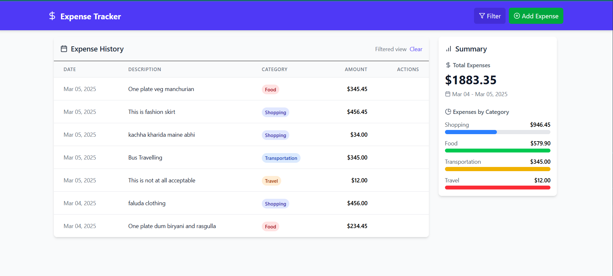
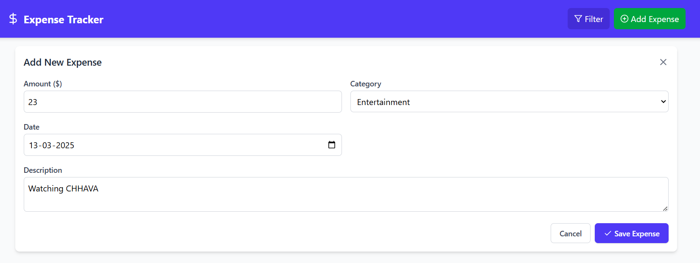
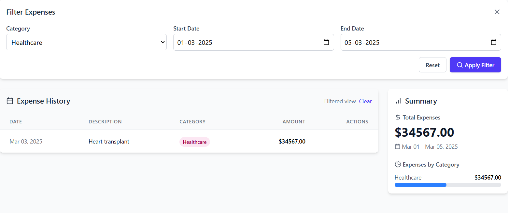
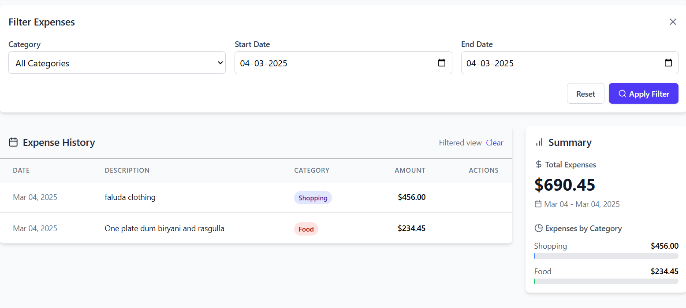

# Project set up guidelines

### prerequisites

- Node.js
- MongoDB
- Git
  

## Clone the repository

```
    git clone https://github.com/Heartlessplaye/expenseTracker.git
    cd Expense-tracker
```


## Server setup

1. Go to the Server folder

```
cd server

```

2. Install dependencies

```
npm i

```

3. Start the MongoDB server locally  and Create `.env` file in the `server` folder and add the dependencies according to `.env.example` file

```
 PORT=
 MONGO_URI=

```

4. Start server

```
npm start

```

## Client Setup

1. Go to frontend folder

```
   cd client/vite-project
   

```

2. Install dependencies

```
   npm install

```

3. Start frontend server

```
npm run dev

```

## Working
Now MongoDB, backend, and frontend are running 

Frontend: http://localhost:5173 (default)
Backend: http://localhost:5000 (default)

## Landing Page 


## Adding expense


## Filter by category && date interval


## Filter by date only

